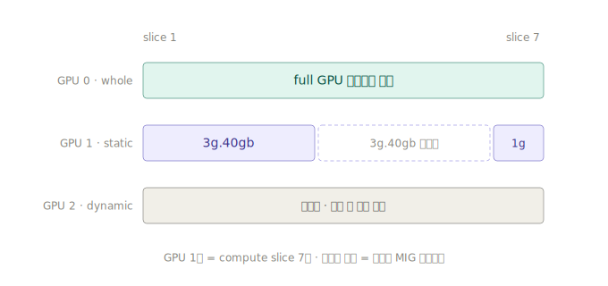
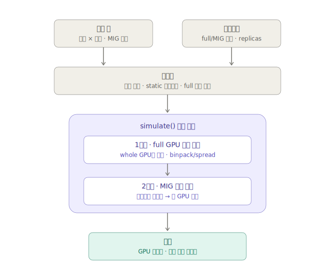
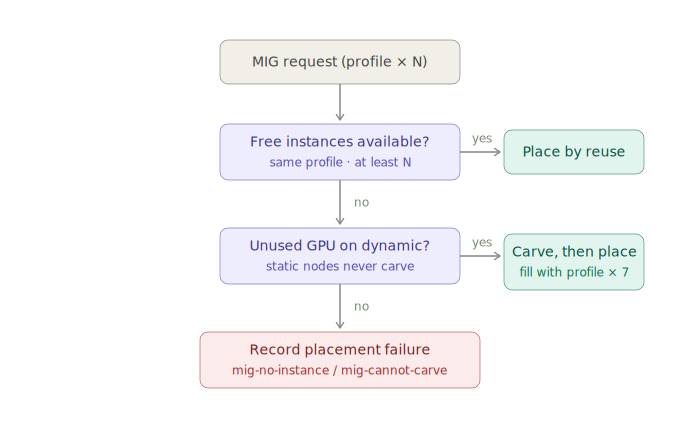

# Moira — How It Works

This document explains the core behavior of the MIG-aware GPU cluster
capacity simulator. Read it in order: resource model → full pipeline →
MIG placement decision flow.

> Every simulation runs in the browser via the pure function `simulate()`.
> The cluster information you enter is never sent to a server — it lives only
> in your browser (localStorage).

---

## 1. Resource model — a GPU is a bar of 7 compute slices

This is the simulator's foundational mental model. One GPU is a bar of
7 compute slices, and how workloads occupy those cells is the entire
simulation. A MIG profile `Ng.XXgb` consumes N slices, and the constraint is
simplified to a single rule: `Σ slices ≤ 7` (the slice-sum model — swapping
in NVIDIA's allowed-combination table is isolated behind the single
`isValidLayout()` function).

| State | Meaning |
|---|---|
| Whole allocation | A full-GPU request (`nvidia.com/gpu: N`) occupies the entire GPU |
| Partitioned | Split into MIG instances. Filled block = allocated, dashed block = empty instance |
| Unused (dynamic) | An intact GPU not yet carved. Available for both full allocation and carving |

**Key rule: whole allocation and partitioning are mutually exclusive per GPU.**
Once partitioned, a GPU can no longer take full-GPU requests — this is what
causes the `mig-mode-mismatch` failure, and it explains the situation where
"there are enough GPUs, yet placement fails."

---

## 2. Full pipeline

How input becomes output. The point of this design is that placement runs in
**two phases**.

### Preprocessing

1. Expand each node pool into `count` individual nodes and initialize the GPU state arrays.
2. Nodes with `migMode=static` pre-partition their GPUs per `staticLayout`. These GPUs are locked out of whole allocations.
3. Sort the workloads: **full requests first (count descending), then MIG requests (profile slices descending).**

### Why full requests place first

With the order reversed, MIG carving eats the dynamic nodes' intact GPUs
first, so full requests arriving later fail even though total GPU capacity is
sufficient. This one sort determines how trustworthy the simulation results are.

---

## 3. MIG request placement decision flow

The decision flow when a single MIG request (profile × N) is placed during
phase two. This is where each failure reason code (`failReason`) originates.

The priority is **reuse first, carve second**. Draining the empty instances
of already-partitioned GPUs first preserves intact GPUs for later full
requests and for carving other profiles.

- **Carving policy (homogeneous):** when carving a new GPU, fill all 7 slices
  with the requested profile (e.g. a `1g.10gb` request → `1g × 7`). Simple
  and predictable.
- **Static nodes never carve.** They only use the instances defined in
  `staticLayout`. This mirrors real operations where node profiles are pinned
  via the GPU Operator's `mig.config` label.
- vCPU/memory are deducted from **node-level totals** regardless of MIG.

---

## 4. Failure reason codes (failReason)

Recording placement failures broken down by cause is this tool's core value.
It must be able to answer "GPUs are left over — why won't this fit?"

| Code | Meaning | Operator action |
|---|---|---|
| `gpu` / `vcpu` / `memory` | Not enough of that resource remains | Add capacity for the bottleneck resource, or shrink the request |
| `model` | `gpuModelConstraint` mismatch | Relax the constraint or add nodes of that model |
| `mig-mode-mismatch` | Full request, but GPUs are locked by partitioning | Consider shrinking the MIG layout |
| `mig-no-instance` | No empty instance of the matching profile (static) | **A signal the layout needs to change** |
| `mig-cannot-carve` | Dynamic, but no whole GPU left to carve | **A signal GPUs themselves are short** |

Distinguishing `mig-no-instance` from `mig-cannot-carve` is deliberate.
The former is a partition-configuration problem and the latter a capacity
problem, so the operator's remedy differs.

---

## 5. What static vs dynamic mode means

| Mode | Operational scenario it models | Use in the simulation |
|---|---|---|
| `disabled` | Nodes without MIG | Basic bin-packing |
| `static` | Layout pinned via GPU Operator | Understand the **actual capacity of the current configuration** |
| `dynamic` | Assumes repartitioning on demand | Understand the **upper bound reachable by reconfiguring** |

Comparing both modes on the same input yields insights like "the current
fixed layout gets 70%, but reconfiguring could reach 91%" — this is the
simulator's core use case.
